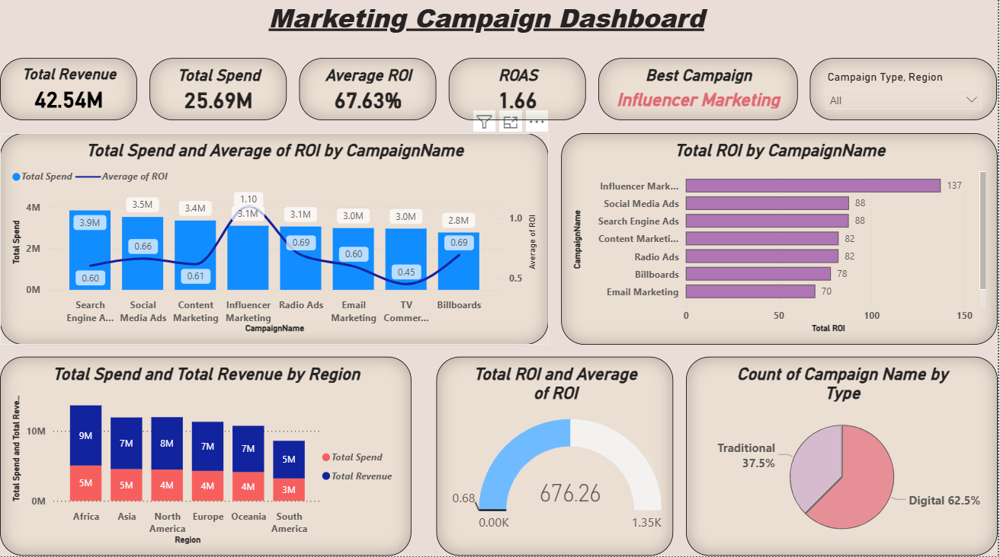

# Marketing Campaign Performance Dashboard

## Overview
Developed an interactive Marketing Campaign Dashboard in Power BI to evaluate campaign effectiveness, marketing spend, revenue generation, ROI, and ROAS across multiple marketing channels. The dashboard helps identify high-performing campaigns and supports data-driven marketing decisions.

## Business Objective
The objective of this project is to analyze marketing campaign performance and identify which channels generate the highest return on investment and revenue.

## Dashboard Highlights
- Revenue and Marketing Spend Analysis
- ROI Analysis by Campaign
- ROAS Performance Tracking
- Campaign Comparison Dashboard
- Regional Revenue Analysis
- Marketing Channel Performance Analysis
- Interactive Campaign Filtering

## Key Insights
- Influencer Marketing delivered the highest ROI among all campaigns.
- Search Engine Advertising generated the highest overall spending.
- Revenue and spend varied significantly across regions.
- Digital campaigns contributed the majority of campaign activities.
- Some campaigns generated stronger returns despite lower spending levels.

## Tools & Technologies
- Power BI
- Microsoft Excel
- DAX
- Data Modeling
- Data Visualization

## Skills Demonstrated
- Marketing Analytics
- KPI Development
- ROI Analysis
- ROAS Analysis
- Dashboard Development
- Data Modeling
- Business Intelligence
- Data Visualization

## Dashboard Preview

## Conclusion
This dashboard provides valuable insights into campaign effectiveness, helping organizations optimize marketing investments and improve overall return on advertising spend.
